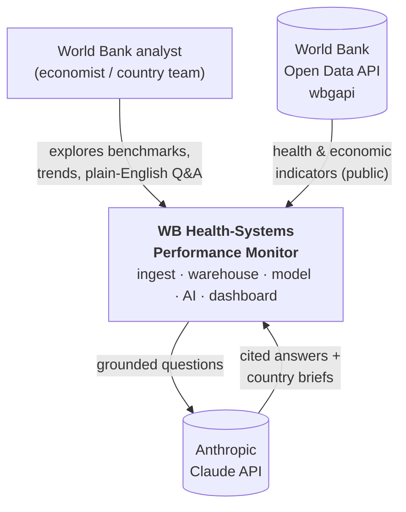
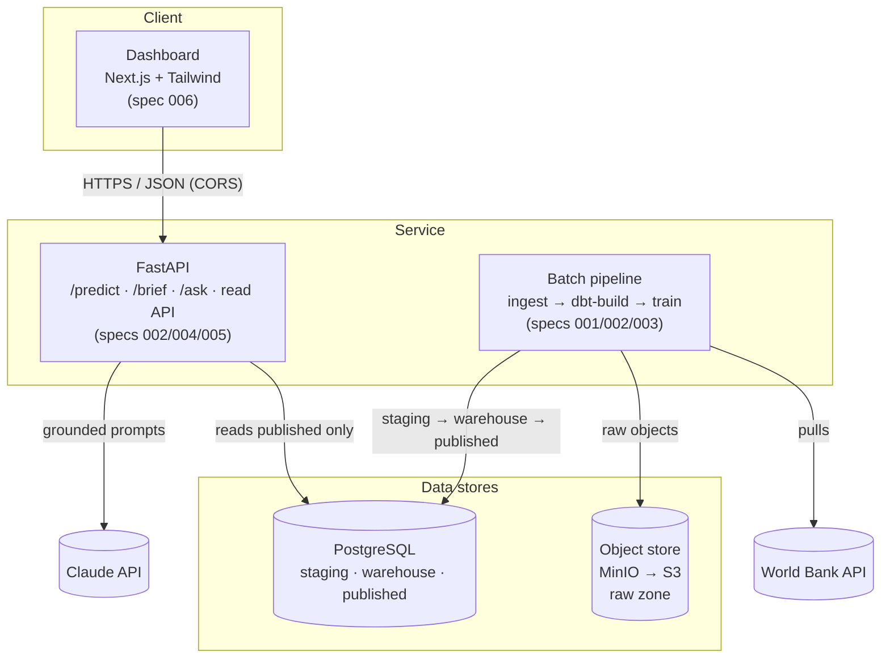
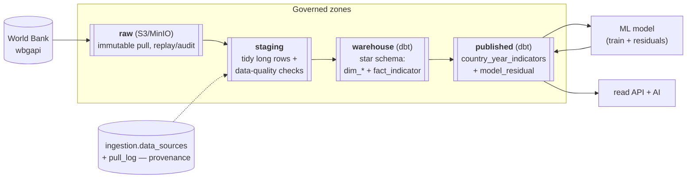
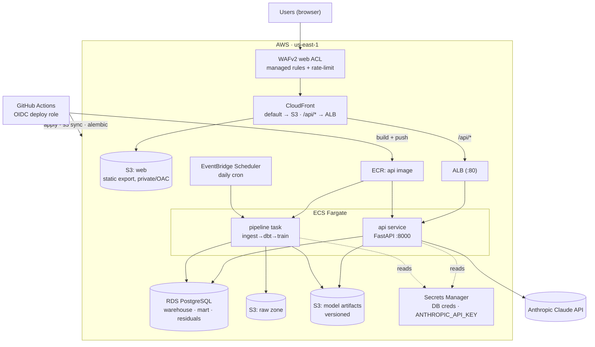
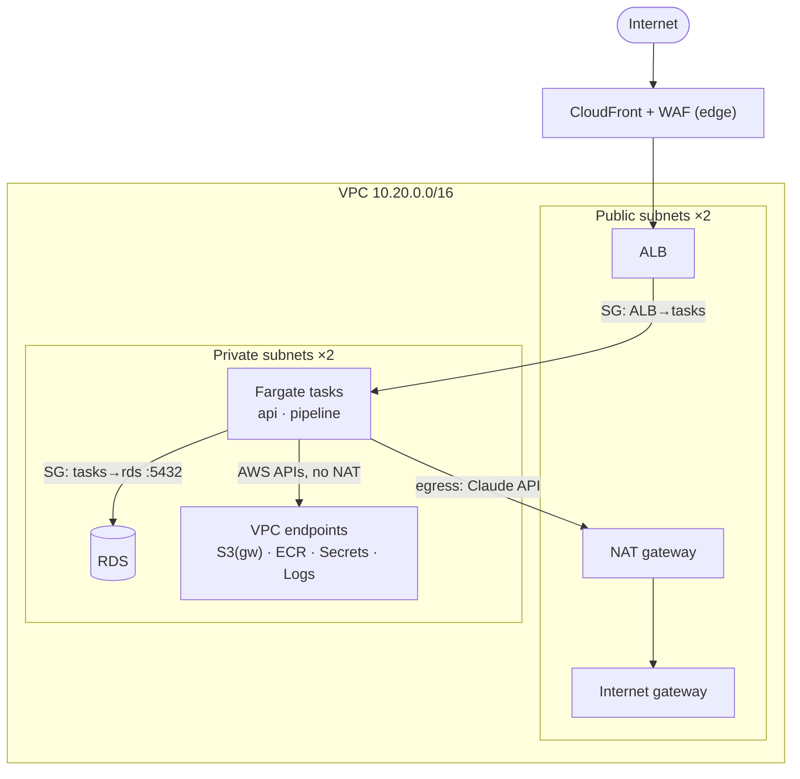

# Reference Architecture

The WB Health-Systems Performance Monitor, described in the standard architecture **views**. Each view
answers a different question; together they are the reference architecture. Diagrams are Mermaid so they
live in git and render on GitHub. The Deployment + Network views are the **built** AWS infra (spec 007),
`terraform apply`-verified live on 2026-08-21.

- [1. System context](#1-system-context) — who and what the system talks to
- [2. Container / application](#2-container--application) — the running pieces
- [3. Data architecture](#3-data-architecture) — how data flows through the zones
- [4. Deployment (AWS)](#4-deployment-aws) — the runtime on AWS
- [5. Network](#5-network) — VPC, subnets, trust boundaries

---

## 1. System context

Who uses it, and which external systems it depends on.

## 2. Container / application

The independently-deployable pieces and how they talk. The read path never touches anything but the
`published` zone (Constitution III).

## 3. Data architecture

The medallion zones — raw is immutable; each zone is derived from the one before; the model and API
read only the published mart. This is the governance spine.

## 4. Deployment (AWS)

Built for spec 007 (v1.2.0) — `terraform apply`-verified live on AWS (2026-08-21), then torn down.
The whole platform as Terraform (`infra/`) + CI/CD. The **dashboard is a static export on S3 +
CloudFront** (no web container); CloudFront routes `/api/*` to the ALB so the browser hits the API
**same-origin**. The batch pipeline is a **scheduled Fargate task**, not a service. Every top-level
resource is tagged `Project=wb-health-monitor` (see `infra/RESOURCES.md`). Diagram = the 60 resources
a `terraform apply` creates.

**Alternative tracks (separate Terraform roots, documented reference — not applied):**
`infra/sagemaker/` (spec 009, managed model lifecycle) and `infra/mwaa/` (spec 012, managed Airflow
orchestration) each replace one slice of the above; adopt deliberately, not by default.

## 5. Network

Only CloudFront/ALB are internet-facing; compute + data sit in **private subnets**. Security groups
chain ALB → tasks → RDS. **VPC endpoints** keep task↔AWS-service traffic off the NAT (S3 via a free
gateway endpoint; ECR/Secrets/Logs via interface endpoints).

---

## Key decisions

The *why* behind this structure lives in the [Architecture Decision Records](adr/README.md); the table
below is the summary.

| Decision | Choice | Why |
|---|---|---|
| Data governance | Medallion zones, read-only `published` | provenance + a single clean read surface |
| Object store | MinIO locally → **S3** in cloud | S3-compatible, zero `boto3` code change |
| Batch pipeline | **scheduled task**, not a service | it runs and exits; no idle compute |
| LLM | Anthropic **Claude** (API/Bedrock) | grounded, cited; not self-hosted |
| Model serving | in-process artifact from S3 | tiny model; a real-time endpoint is overkill |
| Data quality | filter + tripwire gate (spec 008) | public data has real errors; validate, don't trust |
| Frontend hosting | static export → **S3 + CloudFront** | client SPA; no web container; same-origin `/api/*` → ALB |
| Edge security | **WAFv2** on CloudFront | managed rules + rate-limit before the ALB |
| API gateway | **none** — ALB + ACM + Route53 | custom domain + TLS without API Gateway |
| Agent | **LangGraph** + LangSmith (spec 011) | multi-step tool loop; grounding inherited from `/ask` |

*Full detail lives in the specs (`specs/001`–`012`); this is the map, not the territory. The AWS
deployment above is the built `infra/` — see `docs/DEPLOYMENT.md` (runbook) and `infra/RESOURCES.md`
(the 60 resources + cost + teardown).*
