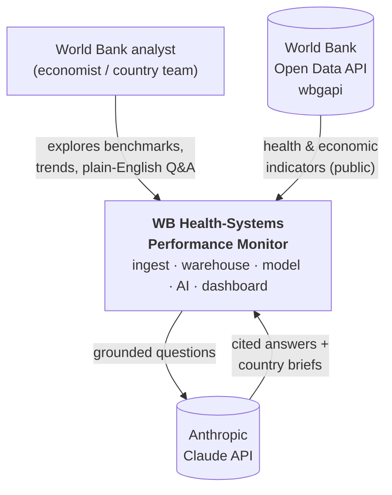
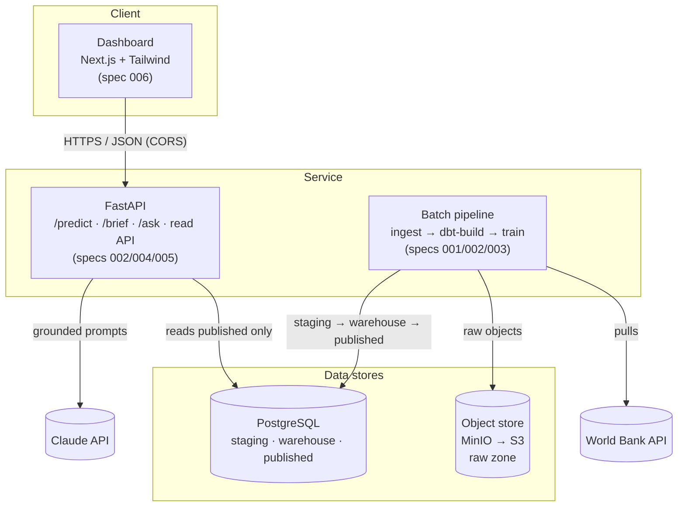
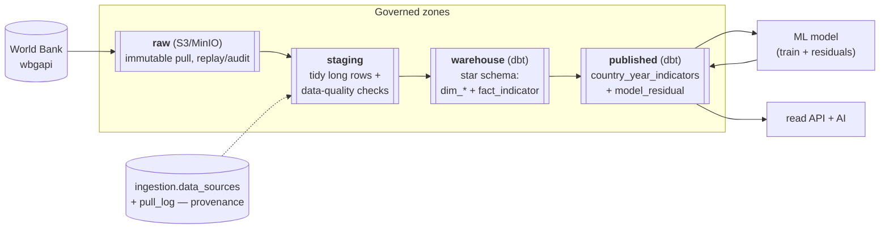
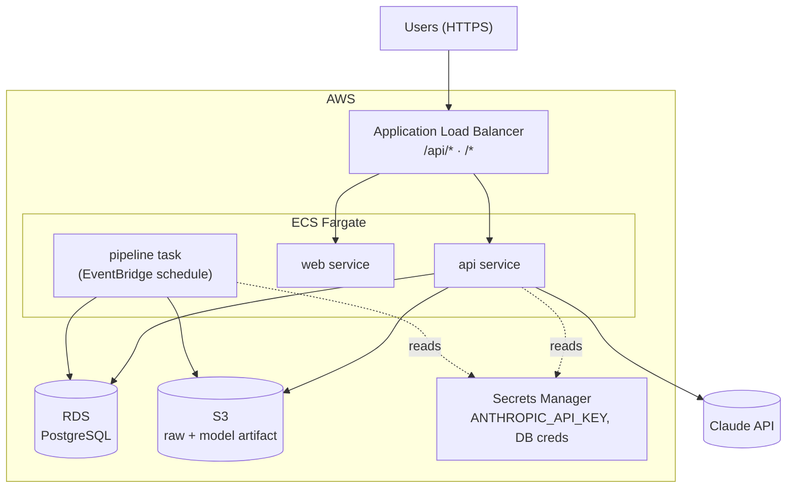
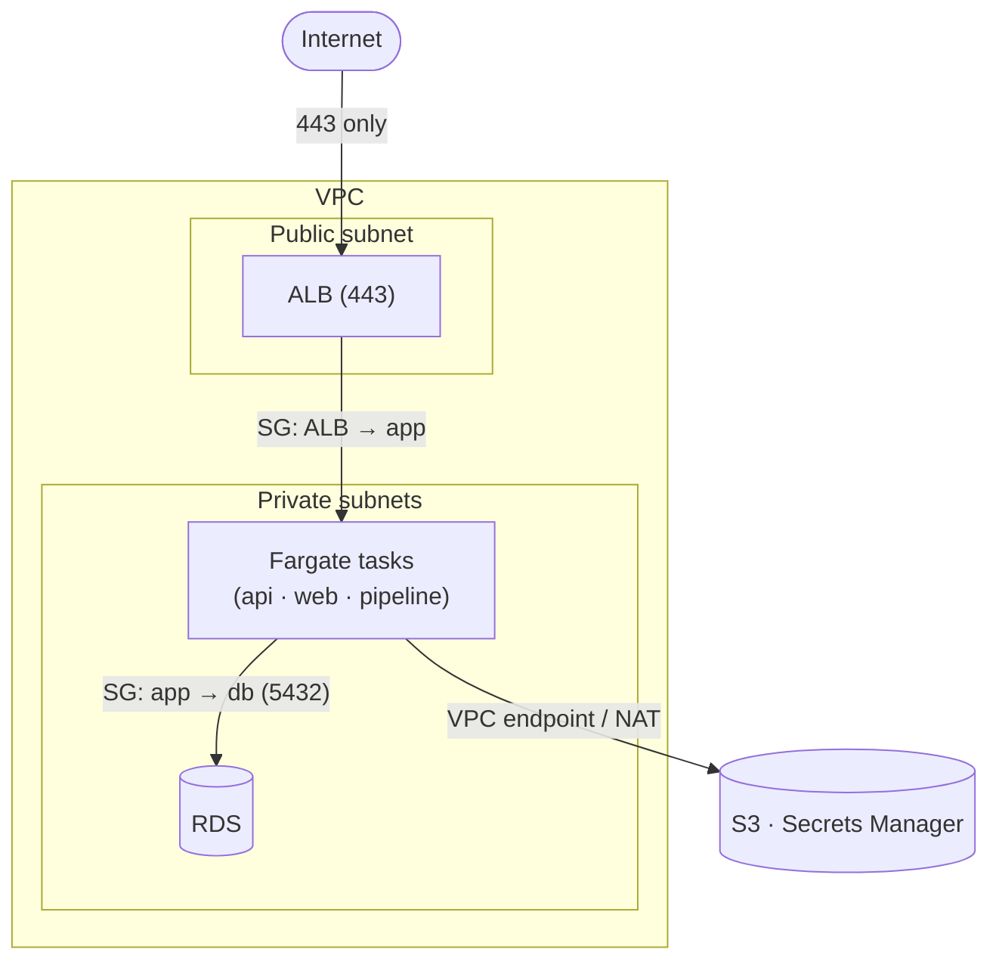

# Reference Architecture

The WB Health-Systems Performance Monitor, described in the standard architecture **views**. Each view
answers a different question; together they are the reference architecture. Diagrams are Mermaid so they
live in git and render on GitHub. Views marked *(planned)* describe the target deployment (spec 007).

- [1. System context](#1-system-context) — who and what the system talks to
- [2. Container / application](#2-container--application) — the running pieces
- [3. Data architecture](#3-data-architecture) — how data flows through the zones
- [4. Deployment *(planned)*](#4-deployment-planned) — the runtime on AWS
- [5. Network *(planned)*](#5-network-planned) — VPC, subnets, trust boundaries

---

## 1. System context

Who uses it, and which external systems it depends on.

## 2. Container / application

The independently-deployable pieces and how they talk. The read path never touches anything but the
`published` zone (Constitution III).

## 3. Data architecture

The medallion zones — raw is immutable; each zone is derived from the one before; the model and API
read only the published mart. This is the governance spine.

## 4. Deployment *(planned)*

Target runtime on AWS (spec 007): everything as Terraform + CI/CD. The batch pipeline is a **scheduled
task**, not a long-running service.

## 5. Network *(planned)*

Trust boundaries (spec 007): only the ALB is public; compute and data sit in private subnets.

---

## Key decisions (ADR-style summary)

| Decision | Choice | Why |
|---|---|---|
| Data governance | Medallion zones, read-only `published` | provenance + a single clean read surface |
| Object store | MinIO locally → **S3** in cloud | S3-compatible, zero `boto3` code change |
| Batch pipeline | **scheduled task**, not a service | it runs and exits; no idle compute |
| LLM | Anthropic **Claude** (API/Bedrock) | grounded, cited; not self-hosted |
| Model serving | in-process artifact from S3 | tiny model; a real-time endpoint is overkill |
| Data quality | filter + tripwire gate (spec 008) | public data has real errors; validate, don't trust |

*Full detail lives in the specs (`specs/001`–`009`); this is the map, not the territory.*
