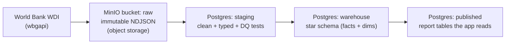

# Data & Storage — where the data comes from, and where it lives

> **Note on the shipped raw format:** the raw zone lands **one CSV per pull** —
> `world_bank_wdi/pull_<id>/wdi_observation.csv` (MinIO locally, S3 in the cloud). Where this doc says
> "NDJSON" or a per-indicator key scheme, treat it as the earlier design; the code
> (`backend/scripts/load_wdi.py`) writes the per-pull CSV above.

Two questions this doc answers:

1. **Where does the data come from?** → the World Bank open data API, via the `wbgapi` client.
2. **Where does it live once we fetch it?** → an object store (**MinIO**) for the raw landing, then Postgres for the curated warehouse.

---

## 1. Where the data comes from

All data is **public World Bank open data** — no account, no API keys, no scraping. We use the official
**[`wbgapi`](https://github.com/tgherzog/wbgapi)** Python client to pull **World Development Indicators (WDI)**.

### The core indicators (our "vital signs")

| Indicator | WB code | Role |
|---|---|---|
| Life expectancy at birth | `SP.DYN.LE00.IN` | outcome |
| Under-5 mortality rate | `SH.DYN.MORT` | outcome |
| Current health expenditure (% of GDP) | `SH.XPD.CHEX.GD.ZS` | spending |
| UHC service coverage index | `SH.UHC.SRVS.CV.XD` | outcome |

Scope: **country and WB-region level** (Sub-Saharan Africa, LAC, …), annual values.

### How to fetch it

```python
import wbgapi as wb

INDICATORS = ["SP.DYN.LE00.IN", "SH.DYN.MORT", "SH.XPD.CHEX.GD.ZS", "SH.UHC.SRVS.CV.XD"]

# A tidy DataFrame: indicators x economies x years
df = wb.data.DataFrame(
    INDICATORS,
    economy=wb.region.members("SSF"),   # Sub-Saharan Africa; use "all" for every country
    time=range(2000, 2023),
    labels=True,
).reset_index()
```

Useful helpers while exploring:
```python
wb.series.info("SP.DYN.LE00.IN")   # what an indicator means, its unit
wb.economy.info()                  # countries + region membership
wb.region.info()                   # WB regions and their codes
```

> `wbgapi` is added to the ingest service's dependencies when the ingestion feature is built
> (`uv add wbgapi` in `backend/`). The snippet above is what that ingest step runs.

---

## 2. Where the data lives — the storage architecture

We use **two** storage systems, each for a different job. Data flows one way, left to right, and only
ever moves forward when its quality checks pass:



- **Raw (immutable) → MinIO.** Every pull from `wbgapi` is written **exactly as received** to an
  object in MinIO. We never edit it; it's the permanent record we can always replay from.
- **Curated → Postgres.** A load step reads the raw objects out of MinIO into the Postgres
  **warehouse** (staging → warehouse → published), where it's cleaned, modelled, and served.

**Why two systems?** Object storage is cheap, simple, and perfect for keeping big immutable files
(the "data lake" / bronze layer). A relational warehouse is where you *query, join, and model*
(the silver/gold layers). This split — **land raw in object storage, curate in a warehouse** — is
exactly how real data platforms are built.

---

## 3. What is MinIO?

**MinIO is S3-compatible object storage that runs locally.** Object storage = you `PUT` and `GET`
files ("objects") into named "buckets" over an HTTP API. Amazon S3 is the famous one; MinIO speaks the
**same API**, so anything that works against S3 works against MinIO unchanged.

**Why we use it here:**
- **Learn S3 without a cloud account or cost.** The code you write against MinIO is the same code
  you'd run against AWS S3 in production — just a different endpoint URL.
- **An immutable raw landing zone.** Ingested data lands here untouched; nothing user-facing reads it.
- **It runs in Docker** alongside the API and Postgres — one `make up` starts everything.

**How code talks to it** (from *inside* the stack, use the service name `minio`, not `localhost`):

| Setting | Value (local) | What it is |
|---|---|---|
| `S3_ENDPOINT_URL` | `http://minio:9000` | the S3 API endpoint apps connect to |
| `S3_ACCESS_KEY` | `MINIO_ROOT_USER` | the "username" |
| `S3_SECRET_KEY` | `MINIO_ROOT_PASSWORD` | the "password" |
| `S3_BUCKET_RAW` | `raw` | the bucket the raw pulls land in |

Any S3 client works — e.g. `boto3` or the `minio` Python package:
```python
import boto3, os
s3 = boto3.client(
    "s3",
    endpoint_url=os.environ["S3_ENDPOINT_URL"],
    aws_access_key_id=os.environ["S3_ACCESS_KEY"],
    aws_secret_access_key=os.environ["S3_SECRET_KEY"],
)
s3.put_object(Bucket="raw", Key="wdi/2026-08-17/SP.DYN.LE00.IN.ndjson", Body=ndjson_bytes)
```

**A suggested bucket layout** (one immutable object per pull):
```
raw/
  wdi/
    2026-08-17/                 # the pull date
      SP.DYN.LE00.IN.ndjson     # one indicator's pull, newline-delimited JSON
      SH.DYN.MORT.ndjson
      ...
```

---

## 4. Run and inspect MinIO locally

MinIO is part of the stack, so it starts with everything else:

```bash
make up
```

Two ports (set in `.env`):

- **Web console** — http://localhost:9001 — log in with `MINIO_ROOT_USER` / `MINIO_ROOT_PASSWORD`
  (from your `.env`). Browse buckets and objects here.
- **S3 API** — http://localhost:9000 — what code connects to (`S3_ENDPOINT_URL`).

**Create the `raw` bucket** (one time — until the ingest step does it automatically): in the console,
**Buckets → Create Bucket → name it `raw` → Create**.

Health check:
```bash
curl -s http://localhost:9000/minio/health/live -o /dev/null -w "%{http_code}\n"   # → 200
```

---

## 5. The end-to-end ingest flow (once the feature is built)

1. **Fetch** — `wbgapi` pulls the indicators for the chosen economies/years.
2. **Land** — write the pull as immutable NDJSON to `raw` in MinIO (+ a `pull_log` row in Postgres).
3. **Load** — read the raw objects from MinIO into Postgres `staging`; run **data-quality tests**.
4. **Build** — conform into the `warehouse` star schema, then aggregate into `published`.
5. **Serve** — the API and dashboard read only from `published`.

Each of these becomes a ticket. See the [constitution](../.specify/memory/constitution.md) (Principle III,
zone discipline) for the rules the pipeline must follow.

## 6. The source registry (where each pull comes from)

Ingestion is **driven by a registry**, not hardcoded. `ingestion.data_sources` holds one row per
source — today just `world_bank_wdi` (`kind = rest-api`, public, no credentials), with its region,
years, and indicators in a `config` JSON column. Every `pull_log` row references its source via
`source_id`, so any loaded value traces back to a registered source (**provenance**).

Adding a second **public** source (e.g. WHO) is a new registry row, not new code. The registry holds
**no secrets** — auth-bearing sources are out of scope here (public data only; constitution Principle I).

```sql
select * from ingestion.data_sources;
select p.pull_id, d.name, p.rows_fetched, p.status
  from ingestion.pull_log p
  join ingestion.data_sources d on d.source_id = p.source_id
 order by p.pull_id desc;
```
